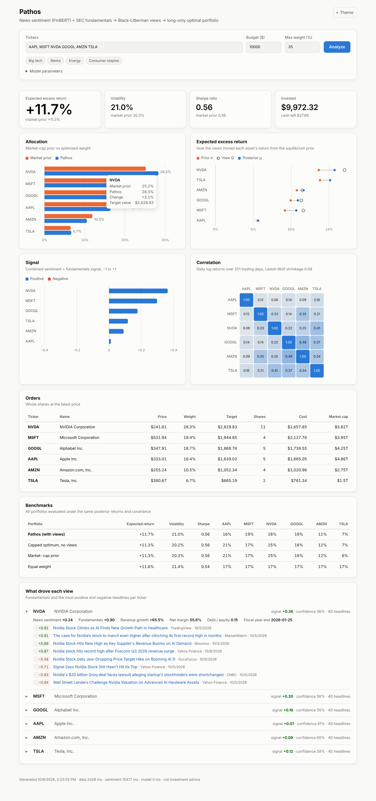
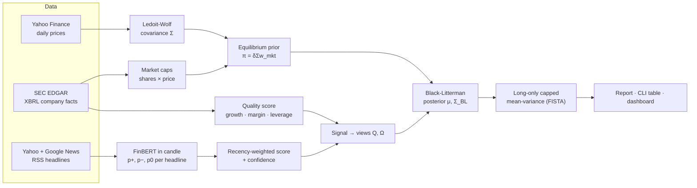

# Pathos

**Sentiment-aware portfolio construction in Rust.** Pathos scores recent news
headlines with **FinBERT running natively in Rust** (via
[candle](https://github.com/huggingface/candle), no Python), blends that with
fundamentals pulled from **SEC EDGAR**, and feeds the result into a
**Black-Litterman** model. A long-only, position-capped mean-variance optimizer
turns that into a portfolio and whole-share orders. You can run it from the
command line or through a web dashboard.



## How it works



1. **Data.** Prices come from the Yahoo chart API and are aligned on common
   trading days before computing log returns. Fundamentals come from SEC
   company facts and are robust to messy filings:
   * try several us-gaap tags per concept;
   * keep only true ~365-day 10-K periods;
   * de-duplicate restatements;
   * reject stale data.

   Headlines come from Yahoo Finance and Google News RSS, filtered to ones that
   actually mention the company. Every response is cached on disk.
2. **Sentiment.** `ProsusAI/finbert` (BERT-base + pooler + classifier) runs in
   candle. Weights are pinned to a specific Hub revision and SHA-256 verified.
   They were checked to be bit-identical to the official PyTorch checkpoint,
   with outputs matching `transformers` to 4 decimal places. Each headline gets
   a polarity score $s = p_{+} - p_{-}$. These are combined per ticker with a
   3-day half-life. Confidence grows with the effective number of headlines and
   shrinks when they disagree. Scores are memoized, so repeat runs skip
   inference.
3. **Signal.** A confidence-weighted blend of news sentiment and a fundamentals
   quality score (revenue growth, net margin, debt/equity).
4. **Black-Litterman.** One absolute view per asset with a meaningful signal:

   $$Q_i = \pi_i + \kappa\, \text{signal}_i\, \sigma_i, \qquad \Omega_{ii} = \tau\sigma_i^2\,\frac{1-c_i}{c_i}$$

   so a signal of ±1 tilts expected return by $\kappa$ volatilities, and a
   confidence of $c = 0.5$ lands halfway between prior and view (Idzorek-style).
   The posterior is

   $$\mu_{BL} = \pi + \tau\Sigma P^\top\left(P\tau\Sigma P^\top + \Omega\right)^{-1}(Q - P\pi)$$

   solved with a Cholesky factorization rather than explicit inverses.
5. **Optimization.** The optimizer solves

   $$\max_w\ \mu^\top w - \tfrac{\delta}{2} w^\top \Sigma_{BL} w \quad \text{s.t.}\quad \textstyle\sum w_i = 1,\ 0 \le w_i \le w_{\max}$$

   using FISTA, with an exact projection onto the capped simplex. Weights are
   then rounded to whole shares with a greedy pass that spends leftover cash
   where it best reduces tracking error.

## Quick start

Requires a recent stable Rust toolchain (edition 2024).

```bash
# SEC requires a contact email in the User-Agent for EDGAR API access.
export SEC_USER_AGENT="Your Name you@example.com"

# Web dashboard on http://127.0.0.1:3000
cargo run --release -- serve

# Or the CLI
cargo run --release -- analyze AAPL MSFT NVDA GOOGL AMZN TSLA --budget 10000 --json report.json

# Score arbitrary text with FinBERT
cargo run --release -- score "Shares surge after record quarterly earnings"
```

On the first run, about 440 MB of FinBERT weights are downloaded and verified
into `~/.cache/pathos/models/finbert`. A full analysis of six tickers takes
roughly 15 seconds on a laptop CPU, almost all of it inference. Repeat runs are
much faster because both HTTP responses and headline scores are cached.

Without `SEC_USER_AGENT` everything still works, with two fallbacks: no
fundamentals, and an equal-weight prior instead of market caps. The report
warns you when this happens.

### Docker

```bash
docker build -t pathos .
docker run -p 3000:3000 -e SEC_USER_AGENT="Your Name you@example.com" -v pathos-data:/data pathos
```

### Example output

```
Ticker      Price  Sentiment   News   Signal    Prior    Post.   Mkt Wt   Weight      Value Shares
-----------------------------------------------------------------------------------------------------
NVDA       241.60      +0.28     40    +0.39   +13.6%   +15.9%    25.2%    28.6%    2858.83     11
MSFT       531.94      +0.19     40    +0.31    +9.2%   +10.8%    17.1%    19.2%    1915.62      4
GOOGL      347.91      +0.01     40    +0.16    +9.9%   +10.9%    18.4%    17.8%    1780.57      5
AAPL       333.01      -0.07     40    +0.03    +5.5%    +5.7%    21.0%    16.3%    1628.89      5
AMZN       255.24      +0.08     40    +0.16   +10.7%   +11.9%    11.9%    11.7%    1170.67      4
TSLA       380.67      +0.13     40    +0.12   +13.8%   +15.2%     6.5%     6.5%     645.41      2

Expected excess return +11.9%  ·  Volatility 21.0%  ·  Sharpe 0.57
Invested 9972.32  ·  Cash left 27.68
```

## Configuration

| Flag / field | Default | Meaning |
|---|---|---|
| `--budget` | 10000 | Cash to allocate |
| `--max-weight` | 0.35 | Position cap (raised to 1/N if infeasible) |
| `--lookback-days` | 365 | Price history for the risk model |
| `--news-days` | 7 | Headline window |
| `--risk-aversion` | 2.5 | δ, used for the prior and the optimizer |
| `--tau` | 0.05 | Black-Litterman τ |
| `--view-scale` | 0.25 | κ, the view tilt in volatilities |
| `--sentiment-weight` | 0.7 | News vs. fundamentals share of the signal |

| Environment variable | Purpose |
|---|---|
| `SEC_USER_AGENT` | `"Name email"` contact string required by SEC EDGAR |
| `PATHOS_CACHE_DIR` | HTTP cache and model location (default `~/.cache/pathos`) |
| `PATHOS_MODEL_DIR` | Override the FinBERT weights directory |
| `RUST_LOG` | Log filter, e.g. `pathos=debug` |

The dashboard talks to a small JSON API:

* `POST /api/analyze` takes the same fields as the table above (plus
  `tickers`) and returns the full report.
* `GET /api/defaults` returns the default parameters.
* `GET /api/health` is a liveness check.

## Evaluating the signal

A sentiment signal is only worth using if it predicts returns. `pathos evaluate`
tests that on point-in-time historical data and fits the signal-to-view mapping
from the results instead of using hand-picked constants.

```bash
cargo run --release -- evaluate                  # 24 large caps, last 2 years
cargo run --release -- evaluate AAPL MSFT NVDA JPM XOM KO --years 1
cargo run --release -- evaluate --headlines-csv news.csv   # your own dated headlines
```

What it does:

1. **Collects historical headlines** from date-bounded Google News queries, one
   per ticker-week, or from a CSV with date, ticker and headline columns (for
   example [FNSPID](https://huggingface.co/datasets/Zihan1004/FNSPID)). Scores
   are cached, so FinBERT only runs once per headline.
2. **Avoids look-ahead.** A signal on day $t$ uses only headlines dated before
   $t$ and SEC facts *filed* by $t$. It trades at the close of $t$ and is
   measured against the return from $t$ to $t+h$.
3. **Measures the information coefficient**, the cross-sectional rank
   correlation between the signal and forward market-excess returns, at 1, 5
   and 21 days. It tests four signals: sentiment level, sentiment surprise
   versus the ticker's own 60-day average, sentiment with recent momentum
   removed, and fundamentals. Standard errors are Newey-West, which accounts
   for overlapping return windows.
4. **Calibrates the views** with a pooled regression and Driscoll-Kraay
   standard errors:

   $$\frac{r_{i,t\to t+h}\cdot 252/h}{\sigma_i} = \kappa\, x_{i,t} + \varepsilon$$

   The live model then uses $Q_i = \pi_i + \sigma_i \kappa x_i$, with $\Omega$
   taken from the uncertainty in $\hat\kappa$ plus the noise in each ticker's
   average headline score. A signal with no demonstrated power gets
   $\kappa \approx 0$, and the portfolio falls back to the market prior.
5. **Runs a walk-forward backtest** of five strategies with monthly rebalancing
   and transaction costs: market cap, equal weight, Black-Litterman without
   views, with the hand-tuned views, and with calibrated views. The calibrated
   strategy re-estimates $\kappa$ at each rebalance using only returns that
   had already been realized. The report includes Sharpe ratio, maximum
   drawdown, turnover, information ratio and bootstrap confidence intervals.

Results go to `evaluation/`. The fitted calibration is installed for
`analyze` and `serve`, which use it automatically (`--no-calibration` opts out).

## Project layout

```
src/
  data/       prices (Yahoo), sec (EDGAR fundamentals), news (RSS + relevance filter)
  sentiment/  finbert (candle model + tokenizer), download (pinned, verified weights), aggregation
  model/      covariance (Ledoit-Wolf), black_litterman, signals + calibration (views), optimizer (FISTA)
  research/   archive (historical headlines), panel (point-in-time signals), stats (IC, HAC SEs,
              bootstrap), backtest (walk-forward), evaluate (orchestration + report)
  pipeline.rs orchestration, caching, share rounding
  server.rs   axum API + embedded dashboard (web/index.html)
  main.rs     CLI: analyze · serve · evaluate · score · download-model
```

## Development

```bash
cargo test                                    # unit tests: math, parsing, signals, rounding
cargo clippy --all-targets -- -D warnings
cargo fmt --check
```

CI runs all three on every push.

## Limitations

* **The historical news source is approximate.** The Google News archive has
  only day-level timestamps (handled with a one-day lag), and it reflects which
  articles still exist today. The universe is also chosen today, which
  introduces survivorship bias. A CSV import of a curated dataset avoids the
  first two problems.
* **The analysis benchmarks table isn't a backtest.** It compares portfolios
  under the model's own posterior; use `pathos evaluate` for realized,
  out-of-sample performance.
* **US coverage only.** Fundamentals are available only for SEC registrants.
  ETFs and foreign listings fall back to price-only treatment.
* **Not investment advice.**
